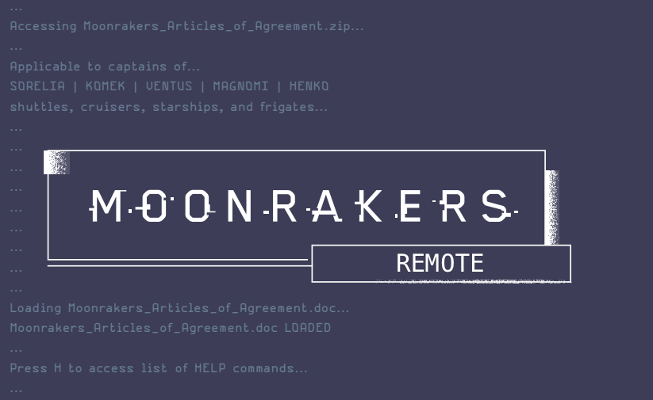

A code for using a webcam to capture and display the state of a Moonrakers game contract/shop board so I can play remotely with my friends.



## Overview

This tool watches a physical Moonrakers contract/shop board (or a manually-entered one) and mirrors it to a live webpage, so remote players can see the current cards without a video call pointed at the table.

- **detect** mode uses a webcam to find the board via ArUco markers, crop out each card zone, and match each card against a local image library.
- **manual** and **random** modes skip the camera entirely: cards are picked manually or drawn at random from the library of cards, and have options to reroll/clear from the webpage.

Run the board pipeline from the repository root. The webpage is hosted locally at http://127.0.0.1:8000/src/index.html.

```sh
python src/pipeline.py --mode detect
```

Pipeline modes:

- `detect` (default) uses the selected camera to recognize board cards.
- `manual` starts without a camera. Click a slot to search its card library, or clear it.
- `random` starts without a camera and fills the slots with random cards. Click a card to reroll that slot, or clear it.

To select another mode, run `python src/pipeline.py --mode manual` or `python src/pipeline.py --mode random`. The default camera index is 0; use `--camera N` to select another device. Use `--host` and `--port` to change the web server address.

To share the page through cloudflared, first launch the local server and then run:

```sh
cloudflared tunnel --url http://127.0.0.1:8000
```

Credit to Carla-Codes for the star twinkling images and design.